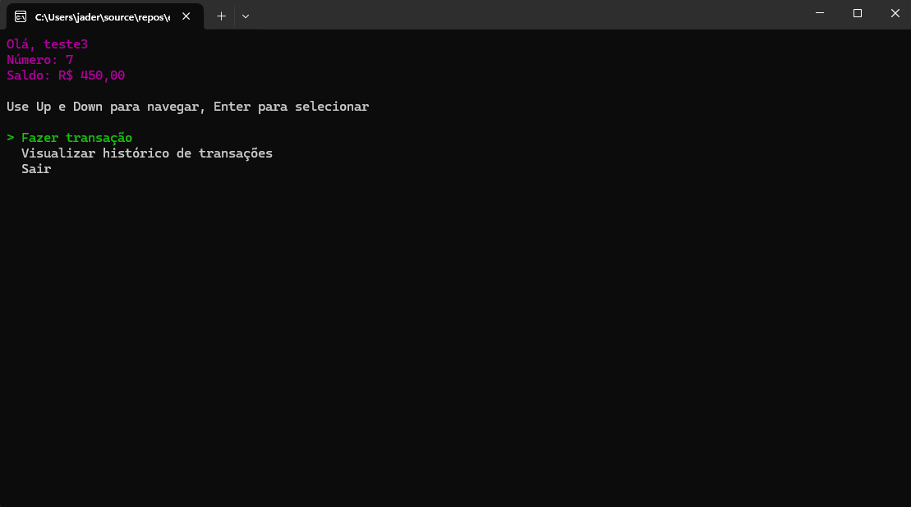
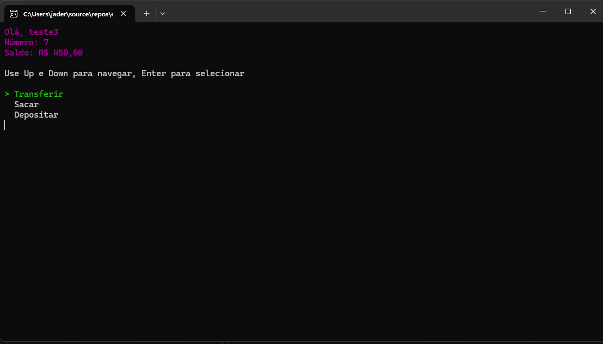
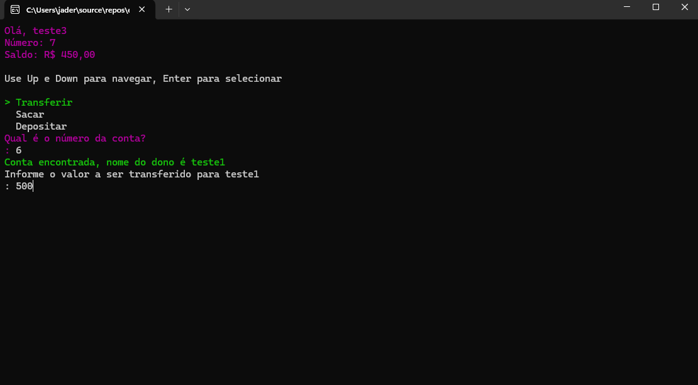
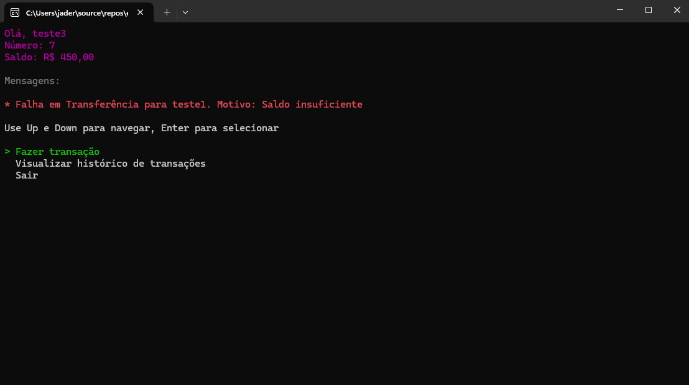
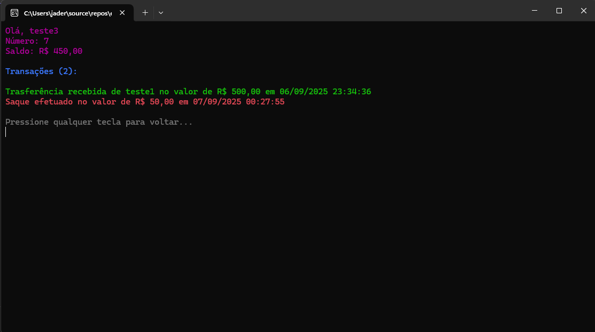

# 💸 Caixa Eletrônico (ATM Simples)

Este projeto é uma simulação de um **Caixa Eletrônico (ATM)** feito em C#, como parte do curso da [Estartando Devs](https://estartandodevs.com.br/). Ele permite ao usuário realizar operações bancárias básicas via terminal.

---

## 🛠️ Funcionalidades

- [x] Cadastro de conta bancária
- [ ] Autenticação por número da conta e senha
- [x] Ver saldo
- [x] Realizar depósitos
- [x] Realizar saques
- [x] Transferências entre contas
- [x] Histórico de transações

---

## ⚙️ Tecnologias e Padrões Utilizados

- ✅ C# .NET (Console Application)
- ✅ SQLite (banco de dados leve local)
- ✅ Interface-based Repositories (boas práticas)
- ✅ Separação de responsabilidades (SOLID)
- ✅ Injeção via Factory (RepositoryFactory.cs)

---

## 🚀 Como Executar

### 1. Clone o repositório:

```bash
git clone git@github.com:estartandodevs-course/CaixaEletronico.git
cd CaixaEletronico
dotnet build
dotnet run
```

# Exemplos


*Figura 1: Tela com opções iniciais*


*Figura 2:  Tela com opções de transferências*


*Figura 3:  Tela de transfererir*


*Figura 4:  Exemplo de mensagem de errro ao tentar transfererir sem saldo*


*Figura 5:  Tela com todas as transações, feitas e recebidas*

## 🙋‍♂️ Autor

Desenvolvido por Jader, aluno do curso Estartando Devs.

